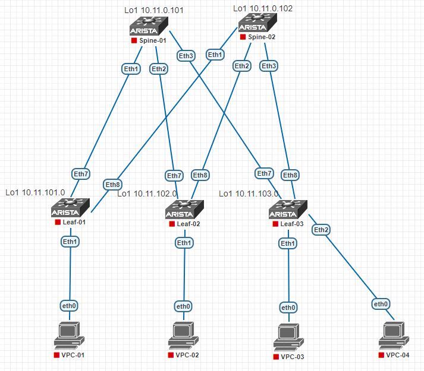

# Домашнее задание
## Проектирование адресного пространства

## Цель:
- ### Собрать схему CLOS
- ### Распределить адресное пространство

## Выполнение
### Схема сети


### Правила распределения адресного пространства:
Предлагаю схему ip адресации c возможностью масштабирования на несколько POD и DC.
Так как в ipv4 адрес сложно уместить всю желаемую информацию о расположении и нумерации девайса, использую несколько допущений:

1. Масштабирование количества оборудования предполагается достигать наращиванием POD/Site и DC
2. Так как underlay адреса не транслируются за пределы фабрики, нет смысла экономить адресное пространство.
3. Согласно ТЗ выбираем уровень переподписки.

В ip адресе loobpack зашифровано местонахождение (DC,POD/Site) и роль устройства в фабрике SuperSpine, Spine, Leaf
В зависимости от октета равного 0 определяется роль устройства:
10.0.y.z - SuperSpine
10.x.0.z - Spine
10.x.y.0 - Leaf

Вне зависимости от положения 0 в ip адресе слева на право закодирован номер DC 1-9, номер POD/Site в DC 0-9, номер loopback 0-2, номер устройства 01-99
 
### Пример Loopback адреса:
```
Loo1
10.0(Superspine).1(DC)1(POD).1(Loopback)01(decice) = DC1,POD1,SS1
10.0.12.101 DC1,POD2,SS1
10.0.13.101 DC1,POD3,SS1
10.11.0.101 DC1,POD1,SP1
10.12.0.102 DC1,POD2,SP2
10.12.0.120 DC1,POD2,SP20
10.11.101.0 DC1,POD1,L1

Loo2
10.11.201.0 DC1,POD1,L1
```
### Стыковочные сети:
```
Для стыковочных сетей предполагается использовать /31 маску.
В ip сети закодировано расположение и роль upstream устройства для облегчения поиска и предупреждения пересечения адресов.

10.x.y.z
x - DC + POD/Site
y - 1-9 - № Superspine
y - 101-199 - № Spine
y - 201-254 - № Leaf (на случай смещения VTEP на гипервизор)
z - /31 выбираются последовательно

10.11.1.0/31 DC1,POD1,SS1,SP20 
10.22.111.0/31 DC2,POD2,SP11
10.22.248.0/31 DC2,POD2,L48
```
### Распределение ip адресов
```
--------------- ------------------- ---------- ------------- ---------- 
Spine-01#
Interface       IP Address          Status     Protocol          MTU   
Ethernet1       10.11.101.2/31      up         up               9214
Ethernet2       10.11.101.4/31      up         up               9214
Ethernet3       10.11.101.6/31      up         up               9214
Loopback1       10.11.0.101/32      up         up              65535
--------------- ------------------- ---------- ------------- ---------- 
Spine-02#
Interface       IP Address          Status     Protocol          MTU    
Ethernet1       10.11.102.2/31      up         up               9214
Ethernet2       10.11.102.4/31      up         up               9214
Ethernet3       10.11.102.6/31      up         up               9214
Loopback1       10.11.0.102/32      up         up              65535
--------------- ------------------- ---------- ------------- ---------- 
Leaf-01#
Interface       IP Address          Status     Protocol          MTU    
Ethernet7       10.11.101.3/31      up         up               9214
Ethernet8       10.11.102.3/31      up         up               9214
Loopback1       10.11.101.0/32      up         up              65535
--------------- ------------------- ---------- ------------- ---------- 
Leaf-02#
Interface       IP Address          Status     Protocol          MTU    
Ethernet7       10.11.101.5/31      up         up               9214
Ethernet8       10.11.102.5/31      up         up               9214
Loopback1       10.11.102.0/32      up         up              65535
--------------- ------------------- ---------- ------------- ---------- 
Leaf-03#
Interface       IP Address          Status     Protocol          MTU   
Ethernet7       10.11.101.7/31      up         up               9214
Ethernet8       10.11.102.7/31      up         up               9214
Loopback1       10.11.103.0/32      up         up              65535
--------------- ------------------- ---------- ------------- ---------- 
```
### Конфигурация интерфейсов
##### spine-1 config
```
!
interface Ethernet1
   description --- Leaf-01 ---
   no switchport
   ip address 10.11.101.2/31
!
interface Ethernet2
   description --- Leaf-02 ---
   no switchport
   ip address 10.11.101.4/31
!
interface Ethernet3
   description --- Leaf-03 ---
   no switchport
   ip address 10.11.101.6/31
!
interface Loopback1
   description --- Routing ---
   ip address 10.11.0.101/32
!
```

##### spine-2 config
```
!
interface Ethernet1
   description --- Leaf-01 ---
   no switchport
   ip address 10.11.102.2/31
!
interface Ethernet2
   description --- Leaf-02 ---
   no switchport
   ip address 10.11.102.4/31
!
interface Ethernet3
   description --- Leaf-03 ---
   no switchport
   ip address 10.11.102.6/31
!
!
interface Loopback1
   description --- For Routing ---
   ip address 10.11.0.102/32
!
```
##### leaf-1 config
	!
	interface Ethernet7
	   description --- Spine-01 ---
	   no switchport
	   ip address 10.11.101.3/31
	!
	interface Ethernet8
	   description --- Spine-02 ---
	   no switchport
	   ip address 10.11.102.3/31
	!
	interface Loopback1
	   description --- For Routing ---
	   ip address 10.11.101.0/32
##### leaf-2 config
```
!
interface Ethernet7
   description --- Spine-01 ---
   no switchport
   ip address 10.11.101.5/31
!
interface Ethernet8
   description --- Spine-02 ---
   no switchport
   ip address 10.11.102.5/31
!
interface Loopback1
   description --- For Routing ---
   ip address 10.11.102.0/32
!
```

##### leaf-3 config
```
!
interface Ethernet7
   description --- Spine-01 ---
   no switchport
   ip address 10.11.101.7/31
!
interface Ethernet8
   description --- Spine-02 ---
   no switchport
   ip address 10.11.102.7/31
!
interface Loopback1
   description --- For Routing ---
   ip address 10.11.103.0/32
```
