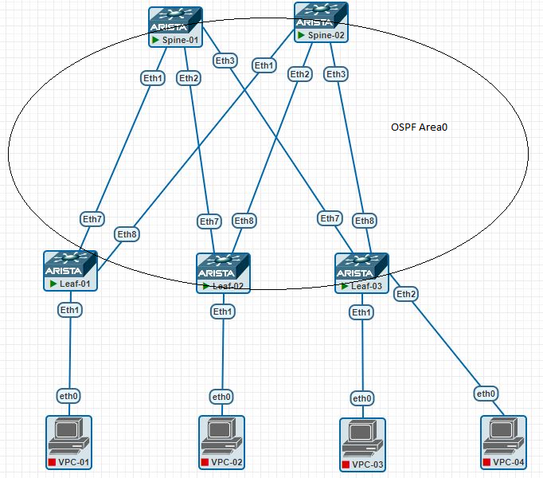

# Домашнее задание №2
## Underlay. OSPF

## Цель:
- ### Настроить OSPF для Underlay сети

## Выполнение
### Схема сети


### План работ
- #### настройка процесса OSPF
    - Area 0
    - Router Id
- #### настройка интерфейсов
    - Area 0
    - network type = 'point to point'
    - BFD
    - OSPF timers = defaults


### Конфигурация оборудования

- spine-1
```
!
interface Ethernet1
   description --- Leaf-01 ---
   no switchport
   ip address 10.11.101.2/31
   ip ospf neighbor bfd
   ip ospf network point-to-point
   ip ospf area 0.0.0.0
!
interface Ethernet2
   description --- Leaf-02 ---
   no switchport
   ip address 10.11.101.4/31
   ip ospf neighbor bfd
   ip ospf network point-to-point
   ip ospf area 0.0.0.0
!
interface Ethernet3
   description --- Leaf-03 ---
   no switchport
   ip address 10.11.101.6/31
   ip ospf neighbor bfd
   ip ospf network point-to-point
   ip ospf area 0.0.0.0
!
!
interface Loopback1
   description --- Routing ---
   ip address 10.11.0.101/32
!
ip routing
no ip routing vrf MGMT
!
ip prefix-list PL_OSPF_OUT seq 10 permit 10.11.0.101/32
!
route-map RM_OSPF_OUT permit 1
   match ip address prefix-list PL_OSPF_OUT
!
router ospf 1
   router-id 10.11.0.101
   passive-interface default
   no passive-interface Ethernet1
   no passive-interface Ethernet2
   no passive-interface Ethernet3
   redistribute connected route-map RM_OSPF_OUT
   max-lsa 12000
!
```
- spine-2
```
!
interface Ethernet1
   description --- Leaf-01 ---
   no switchport
   ip address 10.11.102.2/31
   ip ospf neighbor bfd
   ip ospf network point-to-point
   ip ospf area 0.0.0.0
!
interface Ethernet2
   description --- Leaf-02 ---
   no switchport
   ip address 10.11.102.4/31
   ip ospf neighbor bfd
   ip ospf network point-to-point
   ip ospf area 0.0.0.0
!
interface Ethernet3
   description --- Leaf-03 ---
   no switchport
   ip address 10.11.102.6/31
   ip ospf neighbor bfd
   ip ospf network point-to-point
   ip ospf area 0.0.0.0
!
!
interface Loopback1
   description --- For Routing ---
   ip address 10.11.0.102/32
!
!
ip routing
no ip routing vrf MGMT
!
ip prefix-list PL_OSPF_OUT seq 10 permit 10.11.0.102/32
!
route-map RM_OSPF_OUT permit 1
   match ip address prefix-list PL_OSPF_OUT
!
router ospf 1
   router-id 10.11.0.102
   passive-interface default
   no passive-interface Ethernet1
   no passive-interface Ethernet2
   no passive-interface Ethernet3
   redistribute connected route-map RM_OSPF_OUT
   max-lsa 12000
!
```
- leaf-1
```
!
interface Ethernet7
   description --- Spine-01 ---
   no switchport
   ip address 10.11.101.3/31
   ip ospf neighbor bfd
   ip ospf network point-to-point
   ip ospf area 0.0.0.0
!
interface Ethernet8
   description --- Spine-02 ---
   no switchport
   ip address 10.11.102.3/31
   ip ospf neighbor bfd
   ip ospf network point-to-point
   ip ospf area 0.0.0.0
!
interface Loopback1
   description --- For Routing ---
   ip address 10.11.101.0/32
!
interface Management1
!
ip routing
no ip routing vrf MGMT
!
ip prefix-list PL_OSPF_OUT seq 10 permit 10.11.101.0/32
!
route-map RM_OSPF_OUT permit 1
   match ip address prefix-list PL_OSPF_OUT
!
router ospf 1
   router-id 10.11.101.0
   passive-interface default
   no passive-interface Ethernet7
   no passive-interface Ethernet8
   redistribute connected route-map RM_OSPF_OUT
   max-lsa 12000
!
```

- leaf-2
```
!
interface Ethernet7
   description --- Spine-01 ---
   no switchport
   ip address 10.11.101.5/31
   ip ospf neighbor bfd
   ip ospf network point-to-point
   ip ospf area 0.0.0.0
!
interface Ethernet8
   description --- Spine-02 ---
   no switchport
   ip address 10.11.102.5/31
   ip ospf neighbor bfd
   ip ospf network point-to-point
   ip ospf area 0.0.0.0
!
interface Loopback1
   description --- For Routing ---
   ip address 10.11.102.0/32
!
interface Management1
!
ip routing
no ip routing vrf MGMT
!
ip prefix-list PL_OSPF_OUT seq 10 permit 10.11.102.0/32
!
route-map RM_OSPF_OUT permit 1
   match ip address prefix-list PL_OSPF_OUT
!
router ospf 1
   router-id 10.11.102.0
   passive-interface default
   no passive-interface Ethernet7
   no passive-interface Ethernet8
   redistribute connected route-map RM_OSPF_OUT
   max-lsa 12000
!
```

- leaf-3
```
!
interface Ethernet7
   description --- Spine-01 ---
   no switchport
   ip address 10.11.101.7/31
   ip ospf neighbor bfd
   ip ospf network point-to-point
   ip ospf area 0.0.0.0
!
interface Ethernet8
   description --- Spine-02 ---
   no switchport
   ip address 10.11.102.7/31
   ip ospf neighbor bfd
   ip ospf network point-to-point
   ip ospf area 0.0.0.0
!
interface Loopback1
   description --- For Routing ---
   ip address 10.11.103.0/32
!
interface Management1
!
ip routing
no ip routing vrf MGMT
!
ip prefix-list PL_OSPF_OUT seq 10 permit 10.11.103.0/32
!
route-map RM_OSPF_OUT permit 1
   match ip address prefix-list PL_OSPF_OUT
!
router ospf 1
   router-id 10.11.103.0
   passive-interface default
   no passive-interface Ethernet7
   no passive-interface Ethernet8
   redistribute connected route-map RM_OSPF_OUT
   max-lsa 12000
!
```

### Проверка связанности устройств по протоколу OSPF

#### OSPF-соседства, таблица маршрутов 
```
Spine-01#sh ip ospf neighbor
Neighbor ID     Instance VRF      Pri State                  Dead Time   Address         Interface
10.11.101.0     1        default  0   FULL                   00:00:34    10.11.101.3     Ethernet1
10.11.102.0     1        default  0   FULL                   00:00:35    10.11.101.5     Ethernet2
10.11.103.0     1        default  0   FULL                   00:00:31    10.11.101.7     Ethernet3
Spine-01#


Spine-01#sh ip route ospf

VRF: default
Codes: C - connected, S - static, K - kernel,
       O - OSPF, IA - OSPF inter area, E1 - OSPF external type 1,
       E2 - OSPF external type 2, N1 - OSPF NSSA external type 1,
       N2 - OSPF NSSA external type2, B - Other BGP Routes,
       B I - iBGP, B E - eBGP, R - RIP, I L1 - IS-IS level 1,
       I L2 - IS-IS level 2, O3 - OSPFv3, A B - BGP Aggregate,
       A O - OSPF Summary, NG - Nexthop Group Static Route,
       V - VXLAN Control Service, M - Martian,
       DH - DHCP client installed default route,
       DP - Dynamic Policy Route, L - VRF Leaked,
       G  - gRIBI, RC - Route Cache Route

 O E2     10.11.0.102/32 [110/1] via 10.11.101.3, Ethernet1
                                 via 10.11.101.5, Ethernet2
                                 via 10.11.101.7, Ethernet3
 O E2     10.11.101.0/32 [110/1] via 10.11.101.3, Ethernet1
 O E2     10.11.102.0/32 [110/1] via 10.11.101.5, Ethernet2
 O        10.11.102.2/31 [110/20] via 10.11.101.3, Ethernet1
 O        10.11.102.4/31 [110/20] via 10.11.101.5, Ethernet2
 O        10.11.102.6/31 [110/20] via 10.11.101.7, Ethernet3
 O E2     10.11.103.0/32 [110/1] via 10.11.101.7, Ethernet3

Spine-01#

```
#### Проверка доступности Loopback leaf узлов:
```
Spine-01#ping 10.11.0.102
PING 10.11.0.102 (10.11.0.102) 72(100) bytes of data.
80 bytes from 10.11.0.102: icmp_seq=1 ttl=63 time=11.2 ms
80 bytes from 10.11.0.102: icmp_seq=2 ttl=63 time=7.55 ms
80 bytes from 10.11.0.102: icmp_seq=3 ttl=63 time=7.97 ms
80 bytes from 10.11.0.102: icmp_seq=4 ttl=63 time=19.2 ms
--- 10.11.0.102 ping statistics ---
5 packets transmitted, 4 received, 20% packet loss, time 48ms
rtt min/avg/max/mdev = 7.558/11.494/19.207/4.676 ms, pipe 2, ipg/ewma 12.107/11.525 ms


Spine-01#ping 10.11.101.0
PING 10.11.101.0 (10.11.101.0) 72(100) bytes of data.
80 bytes from 10.11.101.0: icmp_seq=1 ttl=64 time=4.58 ms
80 bytes from 10.11.101.0: icmp_seq=2 ttl=64 time=4.07 ms
80 bytes from 10.11.101.0: icmp_seq=3 ttl=64 time=5.44 ms
80 bytes from 10.11.101.0: icmp_seq=4 ttl=64 time=4.41 ms
80 bytes from 10.11.101.0: icmp_seq=5 ttl=64 time=6.82 ms
--- 10.11.101.0 ping statistics ---
5 packets transmitted, 5 received, 0% packet loss, time 28ms
rtt min/avg/max/mdev = 4.072/5.069/6.829/0.992 ms, ipg/ewma 7.210/4.884 ms


Spine-01#ping 10.11.102.0
PING 10.11.102.0 (10.11.102.0) 72(100) bytes of data.
80 bytes from 10.11.102.0: icmp_seq=1 ttl=64 time=4.24 ms
80 bytes from 10.11.102.0: icmp_seq=2 ttl=64 time=3.77 ms
80 bytes from 10.11.102.0: icmp_seq=3 ttl=64 time=3.56 ms
80 bytes from 10.11.102.0: icmp_seq=4 ttl=64 time=3.93 ms
80 bytes from 10.11.102.0: icmp_seq=5 ttl=64 time=7.20 ms
--- 10.11.102.0 ping statistics ---
5 packets transmitted, 5 received, 0% packet loss, time 32ms
rtt min/avg/max/mdev = 3.568/4.545/7.207/1.350 ms, ipg/ewma 8.098/4.475 ms


Spine-01#ping 10.11.103.0
PING 10.11.103.0 (10.11.103.0) 72(100) bytes of data.
80 bytes from 10.11.103.0: icmp_seq=1 ttl=64 time=4.65 ms
80 bytes from 10.11.103.0: icmp_seq=2 ttl=64 time=3.75 ms
80 bytes from 10.11.103.0: icmp_seq=3 ttl=64 time=3.76 ms
80 bytes from 10.11.103.0: icmp_seq=4 ttl=64 time=3.88 ms
80 bytes from 10.11.103.0: icmp_seq=5 ttl=64 time=7.21 ms
--- 10.11.103.0 ping statistics ---
5 packets transmitted, 5 received, 0% packet loss, time 26ms
rtt min/avg/max/mdev = 3.759/4.654/7.214/1.325 ms, ipg/ewma 6.597/4.730 ms
Spine-01#
``
