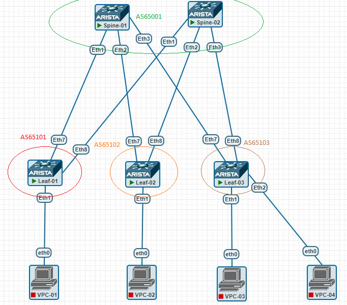

# Домашнее задание №4
## Underlay. eBGP

## Цель:
- ### Настроить eBGP для Underlay сети

## Выполнение
### Схема сети



### План работ
- #### настройка BGP на спайнах
    - router Id
    - peer-группа L_UNDERLAY
    - редистрибуция connected сетей (loopback ip) prefix-list LOOPBACKS

- #### настройка BGP на лифах
    - router Id
    - peer-группа SP_UNDERLAY  
    - редистрибуция connected сетей (loopback ip) prefix-list LOOPBACKS

- #### проверка доступности
 

### Конфигурация оборудования

- spine-1
```
!
interface Ethernet1
   description --- Leaf-01 ---
   no switchport
   ip address 10.11.101.2/31
!
interface Ethernet2
   description --- Leaf-02 ---
   no switchport
   ip address 10.11.101.4/31
!
interface Ethernet3
   description --- Leaf-03 ---
   no switchport
   ip address 10.11.101.6/31
!
!
interface Loopback1
   description --- Routing ---
   ip address 10.11.0.101/32
!
ip routing
!
ip prefix-list LOOPBACKS seq 10 permit 10.11.0.0/16 le 32
!
mpls ip
!
route-map LOOPBACKS permit 10
   match ip address prefix-list LOOPBACKS
!
router bgp 65001
   router-id 10.11.0.101
   neighbor L_UNDERLAY peer group
   neighbor L_UNDERLAY send-community
   neighbor 10.11.101.3 peer group L_UNDERLAY
   neighbor 10.11.101.3 remote-as 65101
   neighbor 10.11.101.5 peer group L_UNDERLAY
   neighbor 10.11.101.5 remote-as 65102
   neighbor 10.11.101.7 peer group L_UNDERLAY
   neighbor 10.11.101.7 remote-as 65103
   redistribute connected route-map LOOPBACKS
!
```
- spine-2
```
!
interface Ethernet1
   description --- Leaf-01 ---
   no switchport
   ip address 10.11.102.2/31
!
interface Ethernet2
   description --- Leaf-02 ---
   no switchport
   ip address 10.11.102.4/31
!
interface Ethernet3
   description --- Leaf-03 ---
   no switchport
   ip address 10.11.102.6/31
!
interface Loopback0
   description --- For Routing ---
   ip address 10.11.0.102/32
!
ip routing
!
ip prefix-list LOOPBACKS seq 10 permit 10.11.0.0/16 le 32
!
mpls ip
!
route-map LOOPBACKS permit 10
   match ip address prefix-list LOOPBACKS
!
router bgp 65001
   router-id 10.11.0.102
   neighbor L_UNDERLAY peer group
   neighbor L_UNDERLAY send-community
   neighbor 10.11.102.3 peer group L_UNDERLAY
   neighbor 10.11.102.3 remote-as 65101
   neighbor 10.11.102.5 peer group L_UNDERLAY
   neighbor 10.11.102.5 remote-as 65102
   neighbor 10.11.102.7 peer group L_UNDERLAY
   neighbor 10.11.102.7 remote-as 65103
   redistribute connected route-map LOOPBACKS
!
```
- leaf-1
```
!
interface Ethernet7
   description --- Spine-01 ---
   no switchport
   ip address 10.11.101.3/31
!
interface Ethernet8
   description --- Spine-02 ---
   no switchport
   ip address 10.11.102.3/31
!
interface Loopback1
   description --- For Routing ---
   ip address 10.11.101.0/32
!
ip routing
no ip routing vrf MGMT
!
ip prefix-list LOOPBACKS seq 10 permit 10.11.0.0/16 le 32
!
mpls ip
!
route-map LOOPBACKS permit 10
   match ip address prefix-list LOOPBACKS
!
router bgp 65101
   router-id 10.11.101.0
   neighbor SP_UNDERLAY peer group
   neighbor SP_UNDERLAY send-community
   neighbor 10.11.101.2 peer group SP_UNDERLAY
   neighbor 10.11.101.2 remote-as 65001
   neighbor 10.11.102.2 peer group SP_UNDERLAY
   neighbor 10.11.102.2 remote-as 65001
   redistribute connected route-map LOOPBACKS
!
```
- leaf-2
 ```
!
interface Ethernet7
   description --- Spine-01 ---
   no switchport
   ip address 10.11.101.5/31
!
interface Ethernet8
   description --- Spine-02 ---
   no switchport
   ip address 10.11.102.5/31
!
interface Loopback1
   description --- For Routing ---
   ip address 10.11.102.0/32
!
!
ip routing
no ip routing vrf MGMT
!
ip prefix-list LOOPBACKS seq 10 permit 10.11.0.0/16 le 32
!
mpls ip
!
route-map LOOPBACKS permit 10
   match ip address prefix-list LOOPBACKS
!
router bgp 65102
   router-id 10.11.102.0
   neighbor SP_UNDERLAY peer group
   neighbor SP_UNDERLAY send-community
   neighbor 10.11.101.4 peer group SP_UNDERLAY
   neighbor 10.11.101.4 remote-as 65001
   neighbor 10.11.102.4 peer group SP_UNDERLAY
   neighbor 10.11.102.4 remote-as 65001
   redistribute connected route-map LOOPBACKS
!
```
- leaf-3
```
!
interface Ethernet7
   description --- Spine-01 ---
   no switchport
   ip address 10.11.101.7/31
!
interface Ethernet8
   description --- Spine-02 ---
   no switchport
   ip address 10.11.102.7/31
!
interface Loopback1
   description --- For Routing ---
   ip address 10.11.103.0/32
!
!
ip routing
!
ip prefix-list LOOPBACKS seq 10 permit 10.11.0.0/16 le 32
!
mpls ip
!
route-map LOOPBACKS permit 10
   match ip address prefix-list LOOPBACKS
!
router bgp 65103
   router-id 10.11.103.0
   neighbor SP_UNDERLAY peer group
   neighbor SP_UNDERLAY send-community
   neighbor 10.11.101.6 peer group SP_UNDERLAY
   neighbor 10.11.101.6 remote-as 65001
   neighbor 10.11.102.6 peer group SP_UNDERLAY
   neighbor 10.11.102.6 remote-as 65001
   redistribute connected route-map LOOPBACKS
!
```
 
 ### Проверка связанности устройств по протоколу BGP

#### BGP-neighbors
```
Leaf-01#sh ip bgp summary
BGP summary information for VRF default
Router identifier 10.11.101.0, local AS number 65101
Neighbor Status Codes: m - Under maintenance
  Neighbor         V  AS           MsgRcvd   MsgSent  InQ OutQ  Up/Down State   PfxRcd PfxAcc
  10.11.101.2      4  65001             42        41    0    0 00:35:14 Estab   8      8
  10.11.102.2      4  65001             33        35    0    0 00:26:43 Estab   8      8
Leaf-01#
```

#### BGP routes
```
Leaf-01#sh ip bgp
BGP routing table information for VRF default
Router identifier 10.11.101.0, local AS number 65101
Route status codes: * - valid, > - active, # - not installed, E - ECMP head, e - ECMP
                    S - Stale, c - Contributing to ECMP, b - backup, L - labeled-unicast
Origin codes: i - IGP, e - EGP, ? - incomplete
AS Path Attributes: Or-ID - Originator ID, C-LST - Cluster List, LL Nexthop - Link Local Nexthop

         Network                Next Hop            Metric  LocPref Weight  Path
 * >     10.11.0.101/32         10.11.101.2           0       100     0       65001 i
 * >     10.11.0.102/32         10.11.102.2           0       100     0       65001 i
 * >     10.11.101.0/32         -                     0       0       -       i
 * >     10.11.101.2/31         -                     1       0       -       i
 *       10.11.101.2/31         10.11.101.2           0       100     0       65001 i
 * >     10.11.101.4/31         10.11.101.2           0       100     0       65001 i
 *       10.11.101.4/31         10.11.102.2           0       100     0       65001 65102 i
 * >     10.11.101.6/31         10.11.101.2           0       100     0       65001 i
 *       10.11.101.6/31         10.11.102.2           0       100     0       65001 65103 i
 * >     10.11.102.0/32         10.11.101.2           0       100     0       65001 65102 i
 *       10.11.102.0/32         10.11.102.2           0       100     0       65001 65102 i
 * >     10.11.102.2/31         -                     1       0       -       i
 *       10.11.102.2/31         10.11.102.2           0       100     0       65001 i
 * >     10.11.102.4/31         10.11.102.2           0       100     0       65001 i
 *       10.11.102.4/31         10.11.101.2           0       100     0       65001 65102 i
 * >     10.11.102.6/31         10.11.102.2           0       100     0       65001 i
 *       10.11.102.6/31         10.11.101.2           0       100     0       65001 65103 i
 * >     10.11.103.0/32         10.11.101.2           0       100     0       65001 65103 i
 *       10.11.103.0/32         10.11.102.2           0       100     0       65001 65103 i
Leaf-01#
```
#### Проверка связности между Loopback узлов
```
Leaf-01#ping 10.11.0.101
PING 10.11.0.101 (10.11.0.101) 72(100) bytes of data.
80 bytes from 10.11.0.101: icmp_seq=1 ttl=64 time=9.93 ms
80 bytes from 10.11.0.101: icmp_seq=2 ttl=64 time=5.96 ms
80 bytes from 10.11.0.101: icmp_seq=3 ttl=64 time=6.54 ms
80 bytes from 10.11.0.101: icmp_seq=4 ttl=64 time=4.05 ms
80 bytes from 10.11.0.101: icmp_seq=5 ttl=64 time=4.28 ms
--- 10.11.0.101 ping statistics ---
5 packets transmitted, 5 received, 0% packet loss, time 42ms
rtt min/avg/max/mdev = 4.056/6.155/9.931/2.113 ms, ipg/ewma 10.555/7.926 ms

Leaf-01#ping 10.11.0.102
PING 10.11.0.102 (10.11.0.102) 72(100) bytes of data.
80 bytes from 10.11.0.102: icmp_seq=1 ttl=64 time=4.65 ms
80 bytes from 10.11.0.102: icmp_seq=2 ttl=64 time=4.01 ms
80 bytes from 10.11.0.102: icmp_seq=3 ttl=64 time=4.78 ms
80 bytes from 10.11.0.102: icmp_seq=4 ttl=64 time=4.44 ms
80 bytes from 10.11.0.102: icmp_seq=5 ttl=64 time=3.88 ms
--- 10.11.0.102 ping statistics ---
5 packets transmitted, 5 received, 0% packet loss, time 30ms
rtt min/avg/max/mdev = 3.885/4.356/4.784/0.360 ms, ipg/ewma 7.587/4.493 ms

Leaf-01#ping 10.11.102.0
PING 10.11.102.0 (10.11.102.0) 72(100) bytes of data.
80 bytes from 10.11.102.0: icmp_seq=1 ttl=63 time=9.71 ms
80 bytes from 10.11.102.0: icmp_seq=2 ttl=63 time=8.87 ms
80 bytes from 10.11.102.0: icmp_seq=3 ttl=63 time=7.79 ms
80 bytes from 10.11.102.0: icmp_seq=4 ttl=63 time=22.4 ms
--- 10.11.102.0 ping statistics ---
5 packets transmitted, 4 received, 20% packet loss, time 45ms
rtt min/avg/max/mdev = 7.798/12.196/22.401/5.930 ms, pipe 2, ipg/ewma 11.290/11.009 ms


Leaf-01#ping 10.11.103.0
PING 10.11.103.0 (10.11.103.0) 72(100) bytes of data.
80 bytes from 10.11.103.0: icmp_seq=1 ttl=63 time=10.7 ms
80 bytes from 10.11.103.0: icmp_seq=2 ttl=63 time=8.57 ms
80 bytes from 10.11.103.0: icmp_seq=3 ttl=63 time=8.87 ms
80 bytes from 10.11.103.0: icmp_seq=4 ttl=63 time=8.70 ms
80 bytes from 10.11.103.0: icmp_seq=5 ttl=63 time=10.2 ms
```
