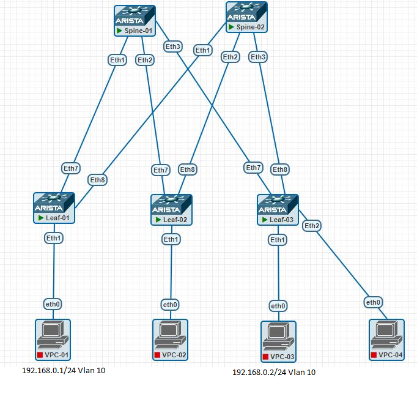

# Домашнее задание №5
## VXLAN L2 VNI

## Цель:
- ### Настроить коммутацию между клиентами c использованием VXLAN L2 VNI

## Выполнение
### Схема сети


### Распределение идентификаторов
|  Клиент |  Subnet  | IP  | Leaf  | Порт подключения  | VLAN  |
| :------------: | :------------: | :------------: | :------------: | :------------: | :------------: |
| Клиент 1 | 192.168.10.0/24  | 192.168.10.1  |  1 | Eht1  |  10 |
| Клиент 2 | 192.168.10.0/24 | 192.168.10.2  |  3 | Eht1   |  10 | 


### План работ (на leafs)
- #### Конфигурация клиентских vlan-интерфейсов
    - vlan Id
    - назначение на access-порт подключения клиентского сервера

- #### Конфигурация VTEP
    - назначение source ip = Lo1 ip
    - маппинг VNI - VLAN
- #### Конфигурация EVPN
    - конфигурация address-family l2vpn evpn
     - настройка RT , RD
    - активация address-family l2vpn evpn для peer group      

### План работ (на spine)
- #### Конфигурация EVPN
    - конфигурация address-family l2vpn evpn
    - активация address-family l2vpn evpn для peer group  

### План работ (на клиентах)
- #### настройка Ip addr на интерфейсе подключения
- #### настройка default route static


### Конфигурация underlay соответствует [OSPF underlay из lab02](/Homework/Lab02/lab02.md)

### Конфигурация оборудования
- spine-1:
```
!
service routing protocols model multi-agent
!
interface Ethernet1
   description --- Leaf-01 ---
   mtu 9214
   no switchport
   ip address 10.11.101.2/31
   ip ospf neighbor bfd
   ip ospf network point-to-point
   ip ospf area 0.0.0.0
!
interface Ethernet2
   description --- Leaf-02 ---
   mtu 9214
   no switchport
   ip address 10.11.101.4/31
   ip ospf neighbor bfd
   ip ospf network point-to-point
   ip ospf area 0.0.0.0
!
interface Ethernet3
   description --- Leaf-03 ---
   mtu 9214
   no switchport
   ip address 10.11.101.6/31
   ip ospf neighbor bfd
   ip ospf network point-to-point
   ip ospf area 0.0.0.0
!
!
interface Loopback1
   description --- Routing ---
   ip address 10.11.0.101/32
!
!
ip routing
!
ip prefix-list PL_OSPF_OUT seq 10 permit 10.11.0.101/32
!
mpls ip
!
route-map RM_OSPF_OUT permit 1
   match ip address prefix-list PL_OSPF_OUT
!
router bgp 65001
   router-id 10.11.0.101
   no bgp default ipv4-unicast
   maximum-paths 4 ecmp 64
   neighbor L_OVERLAY peer group
   neighbor L_OVERLAY next-hop-unchanged
   neighbor L_OVERLAY update-source Loopback1
   neighbor L_OVERLAY ebgp-multihop 3
   neighbor L_OVERLAY send-community extended
   neighbor 10.11.101.0 peer group L_OVERLAY
   neighbor 10.11.101.0 remote-as 65101
   neighbor 10.11.102.0 peer group L_OVERLAY
   neighbor 10.11.102.0 remote-as 65102
   neighbor 10.11.103.0 peer group L_OVERLAY
   neighbor 10.11.103.0 remote-as 65103
   !
   address-family evpn
      neighbor L_OVERLAY activate
!
router ospf 1
   router-id 10.11.0.101
   passive-interface default
   no passive-interface Ethernet1
   no passive-interface Ethernet2
   no passive-interface Ethernet3
   redistribute connected route-map RM_OSPF_OUT
   max-lsa 12000
!
```
- spine-2:
```
!
service routing protocols model multi-agent
!
interface Ethernet1
   description --- Leaf-01 ---
   mtu 9214
   no switchport
   ip address 10.11.102.2/31
   ip ospf neighbor bfd
   ip ospf network point-to-point
   ip ospf area 0.0.0.0
!
interface Ethernet2
   description --- Leaf-02 ---
   mtu 9214
   no switchport
   ip address 10.11.102.4/31
   ip ospf neighbor bfd
   ip ospf network point-to-point
   ip ospf area 0.0.0.0
!
interface Ethernet3
   description --- Leaf-03 ---
   mtu 9214
   no switchport
   ip address 10.11.102.6/31
   ip ospf neighbor bfd
   ip ospf network point-to-point
   ip ospf area 0.0.0.0
!
interface Loopback1
   description --- For Routing ---
   ip address 10.11.0.102/32
!
!
ip routing
!
ip prefix-list PL_OSPF_OUT seq 10 permit 10.11.0.102/32
!
mpls ip
!
route-map RM_OSPF_OUT permit 1
   match ip address prefix-list PL_OSPF_OUT
!
router bgp 65001
   router-id 10.11.0.102
   maximum-paths 4 ecmp 64
   neighbor LEAF_OVERLAY peer group
   neighbor L_OVERLAY peer group
   neighbor L_OVERLAY next-hop-unchanged
   neighbor L_OVERLAY update-source Loopback1
   neighbor L_OVERLAY ebgp-multihop 3
   neighbor L_OVERLAY send-community extended
   neighbor 10.11.101.0 peer group L_OVERLAY
   neighbor 10.11.101.0 remote-as 65101
   neighbor 10.11.102.0 peer group L_OVERLAY
   neighbor 10.11.102.0 remote-as 65102
   neighbor 10.11.103.0 peer group L_OVERLAY
   neighbor 10.11.103.0 remote-as 65103
   !
   address-family evpn
      neighbor L_OVERLAY activate
!
router ospf 1
   router-id 10.11.0.102
   passive-interface default
   no passive-interface Ethernet1
   no passive-interface Ethernet2
   no passive-interface Ethernet3
   redistribute connected route-map RM_OSPF_OUT
   max-lsa 12000
!
```
- leaf-1:
```
!
service routing protocols model multi-agent
!
!
vlan 10,20
!
!
interface Ethernet1
   switchport access vlan 10
!
!
interface Ethernet7
   description --- Spine-01 ---
   mtu 9214
   no switchport
   ip address 10.11.101.3/31
   ip ospf neighbor bfd
   ip ospf network point-to-point
   ip ospf area 0.0.0.0
!
interface Ethernet8
   description --- Spine-02 ---
   mtu 9214
   no switchport
   ip address 10.11.102.3/31
   ip ospf neighbor bfd
   ip ospf network point-to-point
   ip ospf area 0.0.0.0
!
interface Loopback1
   description --- For Routing ---
   ip address 10.11.101.0/32
!
!
interface Vxlan1
   vxlan source-interface Loopback1
   vxlan udp-port 4789
   vxlan vlan 10-20 vni 10010-10020
!
ip routing
!
ip prefix-list PL_OSPF_OUT seq 10 permit 10.11.101.0/32
!
mpls ip
!
route-map RM_OSPF_OUT permit 1
   match ip address prefix-list PL_OSPF_OUT
!
router bgp 65101
   router-id 10.11.101.0
   no bgp default ipv4-unicast
   maximum-paths 4 ecmp 64
   neighbor SP_OVERLAY peer group
   neighbor SP_OVERLAY update-source Loopback1
   neighbor SP_OVERLAY ebgp-multihop 3
   neighbor SP_OVERLAY send-community extended
   neighbor 10.11.0.101 peer group SP_OVERLAY
   neighbor 10.11.0.101 remote-as 65001
   neighbor 10.11.0.102 peer group SP_OVERLAY
   neighbor 10.11.0.102 remote-as 65001
   redistribute connected
   !
   vlan 10
      rd 10.11.101.0:10010
      route-target both 3:10010
      redistribute learned
   !
   vlan 20
      rd 10.11.101.0:10020
      route-target both 3:10020
      redistribute learned
   !
   address-family evpn
      neighbor SP_OVERLAY activate
!
router ospf 1
   router-id 10.11.101.0
   passive-interface default
   no passive-interface Ethernet7
   no passive-interface Ethernet8
   redistribute connected route-map RM_OSPF_OUT
   max-lsa 12000
!
```
- leaf-3:
```
!
vlan 10,20
!
vrf instance MGMT
!
interface Ethernet1
   switchport access vlan 10
!
!
interface Ethernet7
   description --- Spine-01 ---
   mtu 9214
   no switchport
   ip address 10.11.101.7/31
   ip ospf neighbor bfd
   ip ospf network point-to-point
   ip ospf area 0.0.0.0
!
interface Ethernet8
   description --- Spine-02 ---
   mtu 9214
   no switchport
   ip address 10.11.102.7/31
   ip ospf neighbor bfd
   ip ospf network point-to-point
   ip ospf area 0.0.0.0
!
!
interface Loopback1
   description --- For Routing ---
   ip address 10.11.103.0/32
!
!
interface Vxlan1
   vxlan source-interface Loopback1
   vxlan udp-port 4789
   vxlan vlan 10-20 vni 10010-10020
!
ip routing
!
ip prefix-list PL_OSPF_OUT seq 10 permit 10.11.103.0/32
!
mpls ip
!
route-map RM_OSPF_OUT permit 1
   match ip address prefix-list PL_OSPF_OUT
!
router bgp 65103
   router-id 10.11.103.0
   no bgp default ipv4-unicast
   maximum-paths 4 ecmp 64
   neighbor SPINE_OVERLAY peer group
   neighbor SP_OVERLAY peer group
   neighbor SP_OVERLAY update-source Loopback1
   neighbor SP_OVERLAY ebgp-multihop 3
   neighbor SP_OVERLAY send-community extended
   neighbor 10.11.0.101 peer group SP_OVERLAY
   neighbor 10.11.0.101 remote-as 65001
   neighbor 10.11.0.102 peer group SP_OVERLAY
   neighbor 10.11.0.102 remote-as 65001
   redistribute connected
   !
   vlan 10
      rd 10.11.103.0:10010
      route-target both 3:10010
      redistribute learned
   !
   vlan 20
      rd 10.11.103.0:10020
      route-target both 3:10020
      redistribute learned
   !
   address-family evpn
      neighbor SP_OVERLAY activate
!
router ospf 1
   router-id 10.11.103.0
   passive-interface default
   no passive-interface Ethernet7
   no passive-interface Ethernet8
   redistribute connected route-map RM_OSPF_OUT
   max-lsa 12000
!
```

### Проверка состояния VXLAN
```
Leaf-01#show bgp evpn instance vlan 10
EVPN instance: VLAN 10
  Route distinguisher: 10.11.101.0:10010
  Route target import: Route-Target-AS:3:10010
  Route target export: Route-Target-AS:3:10010
  Service interface: VLAN-based
  Local VXLAN IP address: 10.11.101.0
  VXLAN: enabled
  MPLS: disabled
Leaf-01#

Leaf-01#show bgp evpn summary
BGP summary information for VRF default
Router identifier 10.11.101.0, local AS number 65101
Neighbor Status Codes: m - Under maintenance
  Neighbor    V AS           MsgRcvd   MsgSent  InQ OutQ  Up/Down State   PfxRcd PfxAcc
  10.11.0.101 4 65001            249       249    0    0 03:20:29 Estab   4      4
  10.11.0.102 4 65001            260       262    0    0 02:50:56 Estab   4      4
Leaf-01#

Leaf-01#show vxlan address-table
          Vxlan Mac Address Table
----------------------------------------------------------------------

VLAN  Mac Address     Type      Prt  VTEP             Moves   Last Move
----  -----------     ----      ---  ----             -----   ---------
  10  0050.7966.684e  EVPN      Vx1  10.11.103.0      1       0:02:21 ago
Total Remote Mac Addresses for this criterion: 1
Leaf-01#


Leaf-01#show vxlan flood vtep
          VXLAN Flood VTEP Table
--------------------------------------------------------------------------------

VLANS                            Ip Address
-----------------------------   ------------------------------------------------
10                              10.11.102.0     10.11.103.0
20                              10.11.103.0
Leaf-01#

Leaf-01#show vxlan vni
VNI to VLAN Mapping for Vxlan1
VNI         VLAN       Source       Interface       802.1Q Tag
----------- ---------- ------------ --------------- ----------
10010       10         static       Ethernet1       untagged
                                    Vxlan1          10
10020       20         static       Vxlan1          20

VNI to dynamic VLAN Mapping for Vxlan1
VNI       VLAN       VRF       Source
--------- ---------- --------- ------------

Leaf-01#


Leaf-01#show bgp evpn route-type mac-ip
BGP routing table information for VRF default
Router identifier 10.11.101.0, local AS number 65101
Route status codes: * - valid, > - active, S - Stale, E - ECMP head, e - ECMP
                    c - Contributing to ECMP, % - Pending BGP convergence
Origin codes: i - IGP, e - EGP, ? - incomplete
AS Path Attributes: Or-ID - Originator ID, C-LST - Cluster List, LL Nexthop - Link Local Nexthop

          Network                Next Hop              Metric  LocPref Weight  Path
Leaf-01#
how bgp evpn route-type mac-ip
BGP routing table information for VRF default
Router identifier 10.11.101.0, local AS number 65101
Route status codes: * - valid, > - active, S - Stale, E - ECMP head, e - ECMP
                    c - Contributing to ECMP, % - Pending BGP convergence
Origin codes: i - IGP, e - EGP, ? - incomplete
AS Path Attributes: Or-ID - Originator ID, C-LST - Cluster List, LL Nexthop - Link Local Nexthop

          Network                Next Hop              Metric  LocPref Weight  Path
 * >      RD: 10.11.101.0:10010 mac-ip 0050.7966.684c
                                 -                     -       -       0       i
 * >Ec    RD: 10.11.103.0:10010 mac-ip 0050.7966.684e
                                 10.11.103.0           -       100     0       65001 65103 i
 *  ec    RD: 10.11.103.0:10010 mac-ip 0050.7966.684e
                                 10.11.103.0           -       100     0       65001 65103 i
Leaf-01#

```
### Проверка связи между клиентами
```
VPCS> show ip

NAME        : VPCS[1]
IP/MASK     : 192.168.0.1/24
GATEWAY     : 0.0.0.0
DNS         :
MAC         : 00:50:79:66:68:4c
LPORT       : 20000
RHOST:PORT  : 127.0.0.1:30000
MTU         : 1500

VPCS> ping 192.168.0.2

192.168.0.2 icmp_seq=1 timeout
84 bytes from 192.168.0.2 icmp_seq=2 ttl=64 time=16.101 ms
84 bytes from 192.168.0.2 icmp_seq=3 ttl=64 time=19.528 ms
84 bytes from 192.168.0.2 icmp_seq=4 ttl=64 time=16.898 ms
84 bytes from 192.168.0.2 icmp_seq=5 ttl=64 time=16.327 ms

VPCS>
```
