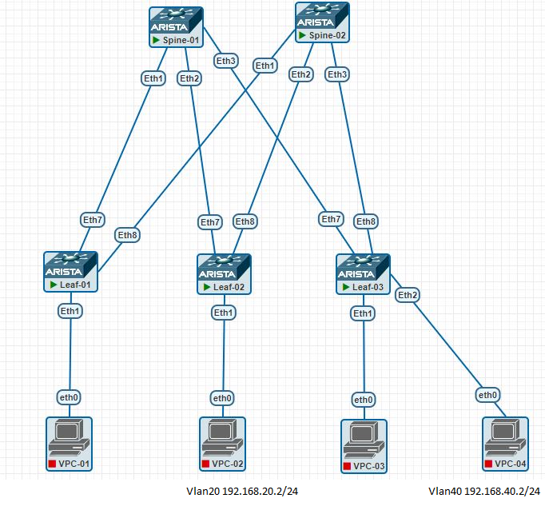

# Домашнее задание №6
## VXLAN L3 VNI

## Цель:
- ### Настроить маршрутизацию в рамках Overlay между клиентами c использованием VXLAN L3VNI

## Выполнение
### Схема сети



### Распределение идентификаторов
|  Клиент |  Subnet  | IP  | Leaf  | Порт подключения  | VLAN  | VRF | VNI |
| :------------: | :------------: | :------------: | :------------: | :------------: | :------------: |:------------: |:------------: |
| Клиент 1 | 192.168.20.2/24  | 192.168.20.1  |  2 | Eht1  |  20 |VRF2040|12040
| Клиент 2 | 192.168.40.2/24 | 192.168.40.2  |  3 | Eht2   |  40 |VRF2040|12040
|

### План работ (на leafs)
- #### Конфигурация VRF
- #### Конфигурация клиентских vlan-интерфейсов
    - назначение на access-порт подключения клиентского сервера
- #### Конфигурация vlan-интерфейса для L3VNI
    - vlan Id
    - включение в Vrf
- #### Конфигурация VTEP
    - назначение source ip = Lo1 ip
    - маппинг VNI - VLAN
    - маппмнг L3VNI - VRF
- #### Конфигурация EVPN
    - конфигурация address-family evpn
    - настройка RT, RD
    - активация address-family evpn для peer group SP_OVERLAY       

### План работ (на spine)
- #### Конфигурация EVPN
    - конфигурация address-family evpn
    - активация address-family evpn для peer group L_OVERLAY 

#### Конфигурация underlay соответствует [OSPF underlay из lab02](/Homework/Lab02/lab02.md)

### Конфигурация оборудования

- spine-1
 ```
!
!
interface Ethernet1
   description --- Leaf-01 ---
   mtu 9214
   no switchport
   ip address 10.11.101.2/31
   ip ospf neighbor bfd
   ip ospf network point-to-point
   ip ospf area 0.0.0.0
!
interface Ethernet2
   description --- Leaf-02 ---
   mtu 9214
   no switchport
   ip address 10.11.101.4/31
   ip ospf neighbor bfd
   ip ospf network point-to-point
   ip ospf area 0.0.0.0
!
interface Ethernet3
   description --- Leaf-03 ---
   mtu 9214
   no switchport
   ip address 10.11.101.6/31
   ip ospf neighbor bfd
   ip ospf network point-to-point
   ip ospf area 0.0.0.0
!
interface Loopback1
   description --- Routing ---
   ip address 10.11.0.101/32
!
ip routing
!
ip prefix-list PL_OSPF_OUT seq 10 permit 10.11.0.101/32
!
mpls ip
!
route-map RM_OSPF_OUT permit 1
   match ip address prefix-list PL_OSPF_OUT
!
router bgp 65001
   router-id 10.11.0.101
   no bgp default ipv4-unicast
   maximum-paths 4 ecmp 64
   neighbor L_OVERLAY peer group
   neighbor L_OVERLAY next-hop-unchanged
   neighbor L_OVERLAY update-source Loopback1
   neighbor L_OVERLAY bfd
   neighbor L_OVERLAY ebgp-multihop 3
   neighbor L_OVERLAY send-community extended
   neighbor 10.11.101.0 peer group L_OVERLAY
   neighbor 10.11.101.0 remote-as 65101
   neighbor 10.11.102.0 peer group L_OVERLAY
   neighbor 10.11.102.0 remote-as 65102
   neighbor 10.11.103.0 peer group L_OVERLAY
   neighbor 10.11.103.0 remote-as 65103
   !
   address-family evpn
      neighbor L_OVERLAY activate
!
router ospf 1
   router-id 10.11.0.101
   passive-interface default
   no passive-interface Ethernet1
   no passive-interface Ethernet2
   no passive-interface Ethernet3
   redistribute connected route-map RM_OSPF_OUT
   max-lsa 12000
!
end
```
- spine-2
```
!
service routing protocols model multi-agent
!
interface Ethernet1
   description --- Leaf-01 ---
   mtu 9214
   no switchport
   ip address 10.11.102.2/31
   ip ospf neighbor bfd
   ip ospf network point-to-point
   ip ospf area 0.0.0.0
!
interface Ethernet2
   description --- Leaf-02 ---
   mtu 9214
   no switchport
   ip address 10.11.102.4/31
   ip ospf neighbor bfd
   ip ospf network point-to-point
   ip ospf area 0.0.0.0
!
interface Ethernet3
   description --- Leaf-03 ---
   mtu 9214
   no switchport
   ip address 10.11.102.6/31
   ip ospf neighbor bfd
   ip ospf network point-to-point
   ip ospf area 0.0.0.0
!
interface Loopback1
   description --- For Routing ---
   ip address 10.11.0.102/32
!
ip routing
!
ip prefix-list PL_OSPF_OUT seq 10 permit 10.11.0.102/32
!
mpls ip
!
route-map RM_OSPF_OUT permit 1
   match ip address prefix-list PL_OSPF_OUT
!
router bgp 65001
   router-id 10.11.0.102
   maximum-paths 4 ecmp 64
   neighbor LEAF_OVERLAY peer group
   neighbor L_OVERLAY peer group
   neighbor L_OVERLAY next-hop-unchanged
   neighbor L_OVERLAY update-source Loopback1
   neighbor L_OVERLAY bfd
   neighbor L_OVERLAY ebgp-multihop 3
   neighbor L_OVERLAY send-community extended
   neighbor 10.11.101.0 peer group L_OVERLAY
   neighbor 10.11.101.0 remote-as 65101
   neighbor 10.11.102.0 peer group L_OVERLAY
   neighbor 10.11.102.0 remote-as 65102
   neighbor 10.11.103.0 peer group L_OVERLAY
   neighbor 10.11.103.0 remote-as 65103
   !
   address-family evpn
      neighbor L_OVERLAY activate
!
router ospf 1
   router-id 10.11.0.102
   passive-interface default
   no passive-interface Ethernet1
   no passive-interface Ethernet2
   no passive-interface Ethernet3
   redistribute connected route-map RM_OSPF_OUT
   max-lsa 12000
!
```
- leaf-2
```
!
service routing protocols model multi-agent
!
!
vlan 10,20,30,40
!
!
vrf instance VRF2040
!
interface Ethernet1
   switchport access vlan 20
!
!
interface Ethernet7
   description --- Spine-01 ---
   mtu 9214
   no switchport
   ip address 10.11.101.5/31
   ip ospf neighbor bfd
   ip ospf network point-to-point
   ip ospf area 0.0.0.0
!
interface Ethernet8
   description --- Spine-02 ---
   mtu 9214
   no switchport
   ip address 10.11.102.5/31
   ip ospf neighbor bfd
   ip ospf network point-to-point
   ip ospf area 0.0.0.0
!
interface Loopback1
   description --- For Routing ---
   ip address 10.11.102.0/32
!
interface Vlan20
   vrf VRF2040
   ip address 192.168.20.1/24
!
interface Vxlan1
   vxlan source-interface Loopback1
   vxlan udp-port 4789
   vxlan vlan 10-20 vni 10010-10020
   vxlan vrf VRF2040 vni 12040
!
ip routing
ip routing vrf VRF2040
!
ip prefix-list PL_OSPF_OUT seq 10 permit 10.11.102.0/32
!
route-map RM_OSPF_OUT permit 1
   match ip address prefix-list PL_OSPF_OUT
!
router bgp 65102
   no bgp default ipv4-unicast
   maximum-paths 4 ecmp 64
   neighbor SP_OVERLAY peer group
   neighbor SP_OVERLAY update-source Loopback1
   neighbor SP_OVERLAY bfd
   neighbor SP_OVERLAY ebgp-multihop 3
   neighbor SP_OVERLAY send-community
   neighbor 10.11.0.101 peer group SP_OVERLAY
   neighbor 10.11.0.101 remote-as 65001
   neighbor 10.11.0.102 peer group SP_OVERLAY
   neighbor 10.11.0.102 remote-as 65001
   !
   vlan 10
      rd 10.11.102.0:10010
      route-target both 3:10010
      redistribute learned
   !
   address-family evpn
      neighbor SP_OVERLAY activate
   !
   vrf VRF2040
      rd 10.11.102.0:12040
      route-target import evpn 1:12040
      route-target export evpn 1:12040
      redistribute connected
!
router ospf 1
   router-id 10.11.102.0
   passive-interface default
   no passive-interface Ethernet7
   no passive-interface Ethernet8
   redistribute connected route-map RM_OSPF_OUT
   max-lsa 12000
!
```
- leaf-3
```
!
service routing protocols model multi-agent
!
vlan 10,20,30,40
!
!
vrf instance VRF2040
!
!
interface Ethernet2
   switchport access vlan 40
!
!
interface Ethernet7
   description --- Spine-01 ---
   mtu 9214
   no switchport
   ip address 10.11.101.7/31
   ip ospf neighbor bfd
   ip ospf network point-to-point
   ip ospf area 0.0.0.0
!
interface Ethernet8
   description --- Spine-02 ---
   mtu 9214
   no switchport
   ip address 10.11.102.7/31
   ip ospf neighbor bfd
   ip ospf network point-to-point
   ip ospf area 0.0.0.0
!
!
interface Loopback1
   description --- For Routing ---
   ip address 10.11.103.0/32
!
interface Vlan40
   vrf VRF2040
   ip address 192.168.40.1/24
!
interface Vxlan1
   vxlan source-interface Loopback1
   vxlan udp-port 4789
   vxlan vlan 10-20 vni 10010-10020
   vxlan vrf VRF2040 vni 12040
!
ip routing
ip routing vrf VRF2040
!
ip prefix-list PL_OSPF_OUT seq 10 permit 10.11.103.0/32
!
mpls ip
!
route-map RM_OSPF_OUT permit 1
   match ip address prefix-list PL_OSPF_OUT
!
router bgp 65103
   router-id 10.11.103.0
   no bgp default ipv4-unicast
   maximum-paths 4 ecmp 64
   neighbor SPINE_OVERLAY peer group
   neighbor SP_OVERLAY peer group
   neighbor SP_OVERLAY update-source Loopback1
   neighbor SP_OVERLAY bfd
   neighbor SP_OVERLAY ebgp-multihop 3
   neighbor SP_OVERLAY send-community extended
   neighbor 10.11.0.101 peer group SP_OVERLAY
   neighbor 10.11.0.101 remote-as 65001
   neighbor 10.11.0.102 peer group SP_OVERLAY
   neighbor 10.11.0.102 remote-as 65001
   redistribute connected
   !
   vlan 10
      rd 10.11.103.0:10010
      route-target both 3:10010
      redistribute learned
   !
   address-family evpn
      neighbor SP_OVERLAY activate
   !
   vrf VRF2040
      rd 10.11.102.0:12040
      route-target import evpn 1:12040
      route-target export evpn 1:12040
      redistribute connected
!
router ospf 1
   router-id 10.11.103.0
   passive-interface default
   no passive-interface Ethernet7
   no passive-interface Ethernet8
   redistribute connected route-map RM_OSPF_OUT
   max-lsa 12000
!
```

### Проверка маршрутизации
```
Leaf-02#show bgp evpn route-type ip-prefix ipv4
BGP routing table information for VRF default
Router identifier 10.11.102.0, local AS number 65102
Route status codes: * - valid, > - active, S - Stale, E - ECMP head, e - ECMP
                    c - Contributing to ECMP, % - Pending BGP convergence
Origin codes: i - IGP, e - EGP, ? - incomplete
AS Path Attributes: Or-ID - Originator ID, C-LST - Cluster List, LL Nexthop - Link Local Nexthop

          Network                Next Hop              Metric  LocPref Weight  Path
 * >      RD: 10.11.102.0:12040 ip-prefix 192.168.20.0/24
                                 -                     -       -       0       i
 * >Ec    RD: 10.11.102.0:12040 ip-prefix 192.168.40.0/24
                                 10.11.103.0           -       100     0       65001 65103 i
 *  ec    RD: 10.11.102.0:12040 ip-prefix 192.168.40.0/24
                                 10.11.103.0           -       100     0       65001 65103 i
Leaf-02#

Leaf-02#show vrf
Maximum number of VRFs allowed: 1024
   VRF           Protocols       State         Interfaces
------------- --------------- ---------------- -------------
   MGMT          IPv4            no routing
   MGMT          IPv6            no routing
   VRF2040       IPv4            routing       Vl20, Vl4093
   VRF2040       IPv6            no routing    Vl4093
   default       IPv4            routing       Et7, Et8, Lo1
   default       IPv6            no routing

Leaf-02#show ip route vrf VRF2040

VRF: VRF2040
Codes: C - connected, S - static, K - kernel,
       O - OSPF, IA - OSPF inter area, E1 - OSPF external type 1,
       E2 - OSPF external type 2, N1 - OSPF NSSA external type 1,
       N2 - OSPF NSSA external type2, B - Other BGP Routes,
       B I - iBGP, B E - eBGP, R - RIP, I L1 - IS-IS level 1,
       I L2 - IS-IS level 2, O3 - OSPFv3, A B - BGP Aggregate,
       A O - OSPF Summary, NG - Nexthop Group Static Route,
       V - VXLAN Control Service, M - Martian,
       DH - DHCP client installed default route,
       DP - Dynamic Policy Route, L - VRF Leaked,
       G  - gRIBI, RC - Route Cache Route

Gateway of last resort is not set

 C        192.168.20.0/24 is directly connected, Vlan20
 B E      192.168.40.0/24 [200/0] via VTEP 10.11.103.0 VNI 12040 router-mac 50:42:47:8b:8b:f5 local-interface Vxlan1

Leaf-02#
```

#### Проверка связности между клиентами
```
VPCS> show ip

NAME        : VPCS[1]
IP/MASK     : 192.168.20.2/24
GATEWAY     : 192.168.20.1
DNS         :
MAC         : 00:50:79:66:68:4d
LPORT       : 20000
RHOST:PORT  : 127.0.0.1:30000
MTU         : 1500

VPCS> ping 192.168.40.2

84 bytes from 192.168.40.2 icmp_seq=1 ttl=62 time=79.438 ms
84 bytes from 192.168.40.2 icmp_seq=2 ttl=62 time=21.551 ms
84 bytes from 192.168.40.2 icmp_seq=3 ttl=62 time=23.065 ms
84 bytes from 192.168.40.2 icmp_seq=4 ttl=62 time=16.937 ms
84 bytes from 192.168.40.2 icmp_seq=5 ttl=62 time=20.460 ms

VPCS>
```
