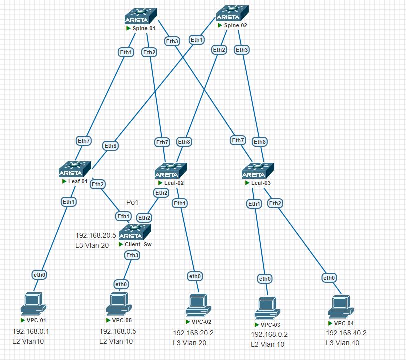

# Домашнее задание №7
## VXLAN. Multihoming.

## Цель:
- ### Настроить отказоустойчивое подключение клиентов с использованием EVPN Multihoming

## Выполнение
### Схема сети



### Распределение идентификаторов
|  Клиент |  Subnet  | IP  | Leaf  | Порт подключения  | VLAN  |
| :------------: | :------------: | :------------: | :------------: | :------------: | :------------: |
| Клиент 2 | 192.168.0.0/24  | 192.168.0.2  |  3 | Eht1  |  10 |
| Клиент 3 | 192.168.0.0/24 | 192.168.0.5  |  1,2 | Eht2   |  trunk, vlan 10 | 
|


### План работ

### Конфигурация underlay соответствует [VxLAN EVPN L2 из lab05](/Homework/Lab05/lab05.md)

### План работ (на leafs)
- #### Присвоение anycast mac
- #### Конфигурация клиентских vlan-интерфейсов
    - vlan Id
    - назначение на access-порт подключения клиентского сервера

- #### Конфигурация VTEP
    - назначение source ip = Lo1 ip
    - маппинг VNI - VLAN
- #### Конфигурация EVPN
    - конфигурация address-family evpn
     - настройка RT , RD
    - активация address-family evpn для peer group SP_OVERLAY     

- #### ethernet-segment ( leafs 1, 2)
  - ##### Конфигурация client Portchannel:
   - lacp
   - режим access с разрешением client vlanid
  - Конфигурация  evpn ethernet-segment
      identifier 
      route-target import 
      lacp system-id 

### План работ (на spine)
- #### Конфигурация EVPN
    - конфигурация address-family evpn
    - активация address-family evpn для peer group L_OVERLAY 


### Настройка клиентов
- Конфигурация агрегированного подключения клиента на коммутаторе Client_sw
  - vlan интерфейс с ip адресом
  - Portchannel в lacp mode
  - static route
- Конфигурация одиночного подключения клиента (leaf-3)


### Конфигурация оборудования
- spine-1 
```
!
service routing protocols model multi-agent
!
interface Ethernet1
   description --- Leaf-01 ---
   mtu 9214
   no switchport
   ip address 10.11.101.2/31
   ip ospf neighbor bfd
   ip ospf network point-to-point
   ip ospf area 0.0.0.0
!
interface Ethernet2
   description --- Leaf-02 ---
   mtu 9214
   no switchport
   ip address 10.11.101.4/31
   ip ospf neighbor bfd
   ip ospf network point-to-point
   ip ospf area 0.0.0.0
!
interface Ethernet3
   description --- Leaf-03 ---
   mtu 9214
   no switchport
   ip address 10.11.101.6/31
   ip ospf neighbor bfd
   ip ospf network point-to-point
   ip ospf area 0.0.0.0
!
!
interface Loopback1
   description --- Routing ---
   ip address 10.11.0.101/32
!
ip routing
!
ip prefix-list PL_OSPF_OUT seq 10 permit 10.11.0.101/32
!
mpls ip
!
route-map RM_OSPF_OUT permit 1
   match ip address prefix-list PL_OSPF_OUT
!
router bgp 65001
   router-id 10.11.0.101
   no bgp default ipv4-unicast
   maximum-paths 4 ecmp 64
   neighbor L_OVERLAY peer group
   neighbor L_OVERLAY next-hop-unchanged
   neighbor L_OVERLAY update-source Loopback1
   neighbor L_OVERLAY ebgp-multihop 3
   neighbor L_OVERLAY send-community extended
   neighbor 10.11.101.0 peer group L_OVERLAY
   neighbor 10.11.101.0 remote-as 65101
   neighbor 10.11.102.0 peer group L_OVERLAY
   neighbor 10.11.102.0 remote-as 65102
   neighbor 10.11.103.0 peer group L_OVERLAY
   neighbor 10.11.103.0 remote-as 65103
   !
   address-family evpn
      neighbor L_OVERLAY activate
!
router ospf 1
   router-id 10.11.0.101
   passive-interface default
   no passive-interface Ethernet1
   no passive-interface Ethernet2
   no passive-interface Ethernet3
   redistribute connected route-map RM_OSPF_OUT
   max-lsa 12000
!
```
- spine-2
```
!
service routing protocols model multi-agent
!
interface Ethernet1
   description --- Leaf-01 ---
   mtu 9214
   no switchport
   ip address 10.11.102.2/31
   ip ospf neighbor bfd
   ip ospf network point-to-point
   ip ospf area 0.0.0.0
!
interface Ethernet2
   description --- Leaf-02 ---
   mtu 9214
   no switchport
   ip address 10.11.102.4/31
   ip ospf neighbor bfd
   ip ospf network point-to-point
   ip ospf area 0.0.0.0
!
interface Ethernet3
   description --- Leaf-03 ---
   mtu 9214
   no switchport
   ip address 10.11.102.6/31
   ip ospf neighbor bfd
   ip ospf network point-to-point
   ip ospf area 0.0.0.0
!
!
interface Loopback1
   description --- For Routing ---
   ip address 10.11.0.102/32
!
ip routing
!
ip prefix-list PL_OSPF_OUT seq 10 permit 10.11.0.102/32
!
mpls ip
!
route-map RM_OSPF_OUT permit 1
   match ip address prefix-list PL_OSPF_OUT
!
router bgp 65001
   router-id 10.11.0.102
   maximum-paths 4 ecmp 64
   neighbor LEAF_OVERLAY peer group
   neighbor L_OVERLAY peer group
   neighbor L_OVERLAY next-hop-unchanged
   neighbor L_OVERLAY update-source Loopback1
   neighbor L_OVERLAY ebgp-multihop 3
   neighbor L_OVERLAY send-community extended
   neighbor 10.11.101.0 peer group L_OVERLAY
   neighbor 10.11.101.0 remote-as 65101
   neighbor 10.11.102.0 peer group L_OVERLAY
   neighbor 10.11.102.0 remote-as 65102
   neighbor 10.11.103.0 peer group L_OVERLAY
   neighbor 10.11.103.0 remote-as 65103
   !
   address-family evpn
      neighbor L_OVERLAY activate
!
router ospf 1
   router-id 10.11.0.102
   passive-interface default
   no passive-interface Ethernet1
   no passive-interface Ethernet2
   no passive-interface Ethernet3
   redistribute connected route-map RM_OSPF_OUT
   max-lsa 12000
!
```
- leaf-1
```
!
service routing protocols model multi-agent
!
vlan 10,20
!
interface Port-Channel1
   switchport trunk allowed vlan 10,20
   switchport mode trunk
   !
   evpn ethernet-segment
      identifier 0000:1111:1111:1111:0000
      route-target import 11:11:11:11:11:11
   lacp system-id 1111.1111.1111
!
interface Ethernet1
   switchport access vlan 10
!
interface Ethernet2
   no switchport
   channel-group 1 mode active
!
!
!
interface Ethernet7
   description --- Spine-01 ---
   mtu 9214
   no switchport
   ip address 10.11.101.3/31
   ip ospf neighbor bfd
   ip ospf network point-to-point
   ip ospf area 0.0.0.0
!
interface Ethernet8
   description --- Spine-02 ---
   mtu 9214
   no switchport
   ip address 10.11.102.3/31
   ip ospf neighbor bfd
   ip ospf network point-to-point
   ip ospf area 0.0.0.0
!
interface Loopback1
   description --- For Routing ---
   ip address 10.11.101.0/32
!
!
interface Vxlan1
   vxlan source-interface Loopback1
   vxlan udp-port 4789
   vxlan vlan 10-20 vni 10010-10020
!
ip virtual-router mac-address aa:bb:cc:dd:ee:ff
!
ip routing
!
ip prefix-list PL_OSPF_OUT seq 10 permit 10.11.101.0/32
!
mpls ip
!
route-map RM_OSPF_OUT permit 1
   match ip address prefix-list PL_OSPF_OUT
!
router bgp 65101
   router-id 10.11.101.0
   no bgp default ipv4-unicast
   maximum-paths 4 ecmp 64
   neighbor SP_OVERLAY peer group
   neighbor SP_OVERLAY update-source Loopback1
   neighbor SP_OVERLAY ebgp-multihop 3
   neighbor SP_OVERLAY send-community extended
   neighbor 10.11.0.101 peer group SP_OVERLAY
   neighbor 10.11.0.101 remote-as 65001
   neighbor 10.11.0.102 peer group SP_OVERLAY
   neighbor 10.11.0.102 remote-as 65001
   redistribute connected
   !
   vlan 10
      rd 10.11.101.0:10010
      route-target both 3:10010
      redistribute learned
   !
   address-family evpn
      neighbor SP_OVERLAY activate
   !
!
router ospf 1
   router-id 10.11.101.0
   passive-interface default
   no passive-interface Ethernet7
   no passive-interface Ethernet8
   redistribute connected route-map RM_OSPF_OUT
   max-lsa 12000
!
```
 - leaf-2
 ```
!
service routing protocols model multi-agent
!
vlan 10
!
interface Port-Channel1
   switchport trunk allowed vlan 10
   switchport mode trunk
   !
   evpn ethernet-segment
      identifier 0000:1111:1111:1111:0000
      route-target import 11:11:11:11:11:11
   lacp system-id 1111.1111.1111
!
!
interface Ethernet2
   channel-group 1 mode active
!
!
interface Ethernet7
   description --- Spine-01 ---
   mtu 9214
   no switchport
   ip address 10.11.101.5/31
   ip ospf neighbor bfd
   ip ospf network point-to-point
   ip ospf area 0.0.0.0
!
interface Ethernet8
   description --- Spine-02 ---
   mtu 9214
   no switchport
   ip address 10.11.102.5/31
   ip ospf neighbor bfd
   ip ospf network point-to-point
   ip ospf area 0.0.0.0
!
interface Loopback1
   description --- For Routing ---
   ip address 10.11.102.0/32
!
interface Vxlan1
   vxlan source-interface Loopback1
   vxlan udp-port 4789
   vxlan vlan 10-20 vni 10010-10020
!
ip virtual-router mac-address aa:bb:cc:dd:ee:ff
!
!
ip prefix-list PL_OSPF_OUT seq 10 permit 10.11.102.0/32
!
route-map RM_OSPF_OUT permit 1
   match ip address prefix-list PL_OSPF_OUT
!
router bgp 65102
   no bgp default ipv4-unicast
   maximum-paths 4 ecmp 64
   neighbor SP_OVERLAY peer group
   neighbor SP_OVERLAY update-source Loopback1
   neighbor SP_OVERLAY ebgp-multihop 3
   neighbor SP_OVERLAY send-community
   neighbor 10.11.0.101 peer group SP_OVERLAY
   neighbor 10.11.0.101 remote-as 65001
   neighbor 10.11.0.102 peer group SP_OVERLAY
   neighbor 10.11.0.102 remote-as 65001
   !
   vlan 10
      rd 10.11.102.0:10010
      route-target both 3:10010
      redistribute learned
   !
   address-family evpn
      neighbor SP_OVERLAY activate
   !
!
router ospf 1
   router-id 10.11.102.0
   passive-interface default
   no passive-interface Ethernet7
   no passive-interface Ethernet8
   redistribute connected route-map RM_OSPF_OUT
   max-lsa 12000
!
```
- leaf-3
```
!
service routing protocols model multi-agent
!
!
vlan 10
!
!
interface Ethernet1
   switchport access vlan 10
!
interface Ethernet7
   description --- Spine-01 ---
   mtu 9214
   no switchport
   ip address 10.11.101.7/31
   ip ospf neighbor bfd
   ip ospf network point-to-point
   ip ospf area 0.0.0.0
!
interface Ethernet8
   description --- Spine-02 ---
   mtu 9214
   no switchport
   ip address 10.11.102.7/31
   ip ospf neighbor bfd
   ip ospf network point-to-point
   ip ospf area 0.0.0.0
!
!
interface Loopback1
   description --- For Routing ---
   ip address 10.11.103.0/32
!
!
interface Vxlan1
   vxlan source-interface Loopback1
   vxlan udp-port 4789
   vxlan vlan 10-20 vni 10010-10020
!
ip routing
!
ip prefix-list PL_OSPF_OUT seq 10 permit 10.11.103.0/32
!
mpls ip
!
route-map RM_OSPF_OUT permit 1
   match ip address prefix-list PL_OSPF_OUT
!
router bgp 65103
   router-id 10.11.103.0
   no bgp default ipv4-unicast
   maximum-paths 4 ecmp 64
   neighbor SPINE_OVERLAY peer group
   neighbor SP_OVERLAY peer group
   neighbor SP_OVERLAY update-source Loopback1
   neighbor SP_OVERLAY ebgp-multihop 3
   neighbor SP_OVERLAY send-community extended
   neighbor 10.11.0.101 peer group SP_OVERLAY
   neighbor 10.11.0.101 remote-as 65001
   neighbor 10.11.0.102 peer group SP_OVERLAY
   neighbor 10.11.0.102 remote-as 65001
   redistribute connected
   !
   vlan 10
      rd 10.11.103.0:10010
      route-target both 3:10010
      redistribute learned
   !
   address-family evpn
      neighbor SP_OVERLAY activate
   !
!
router ospf 1
   router-id 10.11.103.0
   passive-interface default
   no passive-interface Ethernet7
   no passive-interface Ethernet8
   redistribute connected route-map RM_OSPF_OUT
   max-lsa 12000
!
``` 
- Клиентский коммутатор Client_Sw
```
!
vlan 10
!
interface Port-Channel1
   switchport trunk allowed vlan 10
   switchport mode trunk
!
interface Ethernet1
   no switchport
   channel-group 1 mode active
!
interface Ethernet2
   no switchport
   channel-group 1 mode active
!
interface Ethernet3
   switchport access vlan 10
!
```

### Проверка настройки

#### Маршруты EVPN
 ```  
Leaf-01#show bgp evpn route-type ip-prefix ipv4
BGP routing table information for VRF default
Router identifier 10.11.101.0, local AS number 65101
Route status codes: * - valid, > - active, S - Stale, E - ECMP head, e - ECMP
                    c - Contributing to ECMP, % - Pending BGP convergence
Origin codes: i - IGP, e - EGP, ? - incomplete
AS Path Attributes: Or-ID - Originator ID, C-LST - Cluster List, LL Nexthop - Link Local Nexthop

          Network                Next Hop              Metric  LocPref Weight  Path
 * >Ec    RD: 10.11.102.0:12040 ip-prefix 192.168.20.0/24
                                 10.11.102.0           -       100     0       65001 65102 i
 *  ec    RD: 10.11.102.0:12040 ip-prefix 192.168.20.0/24
                                 10.11.102.0           -       100     0       65001 65102 i
 * >Ec    RD: 10.11.102.0:12040 ip-prefix 192.168.40.0/24
                                 10.11.103.0           -       100     0       65001 65103 i
 *  ec    RD: 10.11.102.0:12040 ip-prefix 192.168.40.0/24
                                 10.11.103.0           -       100     0       65001 65103 i
Leaf-01#


Leaf-01#show bgp evpn route-type ethernet-segment
BGP routing table information for VRF default
Router identifier 10.11.101.0, local AS number 65101
Route status codes: * - valid, > - active, S - Stale, E - ECMP head, e - ECMP
                    c - Contributing to ECMP, % - Pending BGP convergence
Origin codes: i - IGP, e - EGP, ? - incomplete
AS Path Attributes: Or-ID - Originator ID, C-LST - Cluster List, LL Nexthop - Link Local Nexthop

          Network                Next Hop              Metric  LocPref Weight  Path
 * >      RD: 10.11.101.0:1 ethernet-segment 0000:1111:1111:1111:0000 10.11.101.0
                                 -                     -       -       0       i
 * >Ec    RD: 10.11.102.0:1 ethernet-segment 0000:1111:1111:1111:0000 10.11.102.0
                                 10.11.102.0           -       100     0       65001 65102 i
 *  ec    RD: 10.11.102.0:1 ethernet-segment 0000:1111:1111:1111:0000 10.11.102.0
                                 10.11.102.0           -       100     0       65001 65102 i
Leaf-01#

Leaf-01#show bgp evpn esi 0000:1111:1111:1111:0000
BGP routing table information for VRF default
Router identifier 10.11.101.0, local AS number 65101
Route status codes: * - valid, > - active, S - Stale, E - ECMP head, e - ECMP
                    c - Contributing to ECMP, % - Pending BGP convergence
Origin codes: i - IGP, e - EGP, ? - incomplete
AS Path Attributes: Or-ID - Originator ID, C-LST - Cluster List, LL Nexthop - Link Local Nexthop

          Network                Next Hop              Metric  LocPref Weight  Path
 * >      RD: 10.11.101.0:10010 auto-discovery 0 0000:1111:1111:1111:0000
                                 -                     -       -       0       i
 * >Ec    RD: 10.11.102.0:10010 auto-discovery 0 0000:1111:1111:1111:0000
                                 10.11.102.0           -       100     0       65001 65102 i
 *  ec    RD: 10.11.102.0:10010 auto-discovery 0 0000:1111:1111:1111:0000
                                 10.11.102.0           -       100     0       65001 65102 i
 * >      RD: 10.11.101.0:1 auto-discovery 0000:1111:1111:1111:0000
                                 -                     -       -       0       i
 * >Ec    RD: 10.11.102.0:1 auto-discovery 0000:1111:1111:1111:0000
                                 10.11.102.0           -       100     0       65001 65102 i
 *  ec    RD: 10.11.102.0:1 auto-discovery 0000:1111:1111:1111:0000
                                 10.11.102.0           -       100     0       65001 65102 i
 * >      RD: 10.11.101.0:1 ethernet-segment 0000:1111:1111:1111:0000 10.11.101.0
                                 -                     -       -       0       i
 * >Ec    RD: 10.11.102.0:1 ethernet-segment 0000:1111:1111:1111:0000 10.11.102.0
                                 10.11.102.0           -       100     0       65001 65102 i
 *  ec    RD: 10.11.102.0:1 ethernet-segment 0000:1111:1111:1111:0000 10.11.102.0
                                 10.11.102.0           -       100     0       65001 65102 i
Leaf-01#
```
#### Client Ping
```
VPCS> show ip

NAME        : VPCS[1]
IP/MASK     : 192.168.0.2/24
GATEWAY     : 0.0.0.0
DNS         :
MAC         : 00:50:79:66:68:4e
LPORT       : 20000
RHOST:PORT  : 127.0.0.1:30000
MTU         : 1500

VPCS> ping 192.168.0.5
84 bytes from 192.168.0.5 icmp_seq=1 ttl=64 time=36.917 ms
84 bytes from 192.168.0.5 icmp_seq=2 ttl=64 time=31.172 ms
84 bytes from 192.168.0.5 icmp_seq=3 ttl=64 time=25.550 ms
84 bytes from 192.168.0.5 icmp_seq=4 ttl=64 time=26.709 ms
84 bytes from 192.168.0.5 icmp_seq=5 ttl=64 time=27.244 ms
```

#### Проверка отказоустойчивости:
**Отключение одного из портов агрегации на Client_Sw**
```
Client_Sw#show port-channel 1 detailed
Port Channel Port-Channel1 (Fallback State: Unconfigured):
Minimum links: unconfigured
Minimum speed: unconfigured
Current weight/Max weight: 1/16
  Active Ports:
       Port            Time Became Active       Protocol       Mode      Weight
    --------------- ------------------------ -------------- ------------ ------
       Ethernet2       1/8/25 20:27:59          LACP           Active      1

  Configured, but inactive ports:
       Port            Time Became Inactive    Reason
    --------------- -------------------------- -----------------------------
       Ethernet1       13:58:52                link down in LACP negotiation
```
**Момент переключения:**
```
Client_Sw#
84 bytes from 192.168.0.5 icmp_seq=50 ttl=64 time=36.653 ms
84 bytes from 192.168.0.5 icmp_seq=51 ttl=64 time=39.466 ms
84 bytes from 192.168.0.5 icmp_seq=52 ttl=64 time=29.670 ms
84 bytes from 192.168.0.5 icmp_seq=53 ttl=64 time=24.589 ms
192.168.0.5 icmp_seq=54 timeout
84 bytes from 192.168.0.5 icmp_seq=55 ttl=64 time=43.733 ms
84 bytes from 192.168.0.5 icmp_seq=56 ttl=64 time=28.857 ms
84 bytes from 192.168.0.5 icmp_seq=57 ttl=64 time=23.402 ms
84 bytes from 192.168.0.5 icmp_seq=58 ttl=64 time=52.632 ms
84 bytes from 192.168.0.5 icmp_seq=59 ttl=64 time=22.028 ms
84 bytes from 192.168.0.5 icmp_seq=60 ttl=64 time=31.356 ms

```
**Активация ранее отключенного порта агрегации.**
```
Client_Sw#show port-channel detailed
Port Channel Port-Channel1 (Fallback State: Unconfigured):
Minimum links: unconfigured
Minimum speed: unconfigured
Current weight/Max weight: 2/16
  Active Ports:
       Port            Time Became Active       Protocol       Mode      Weight
    --------------- ------------------------ -------------- ------------ ------
       Ethernet1       14:00:33                 LACP           Active      1   
       Ethernet2       1/8/25 20:27:59          LACP           Active      1   

Client_Sw#
84 bytes from 192.168.0.5 icmp_seq=151 ttl=64 time=37.123 ms
192.168.0.5 icmp_seq=152 timeout
192.168.0.5 icmp_seq=153 timeout
192.168.0.5 icmp_seq=154 timeout
192.168.0.5 icmp_seq=155 timeout
192.168.0.5 icmp_seq=156 timeout
192.168.0.5 icmp_seq=157 timeout
192.168.0.5 icmp_seq=158 timeout
192.168.0.5 icmp_seq=159 timeout
192.168.0.5 icmp_seq=160 timeout
192.168.0.5 icmp_seq=161 timeout
84 bytes from 192.168.0.5 icmp_seq=162 ttl=64 time=63.863 ms
84 bytes from 192.168.0.5 icmp_seq=163 ttl=64 time=34.779 ms
84 bytes from 192.168.0.5 icmp_seq=164 ttl=64 time=37.946 ms
84 bytes from 192.168.0.5 icmp_seq=165 ttl=64 time=24.772 ms
```
